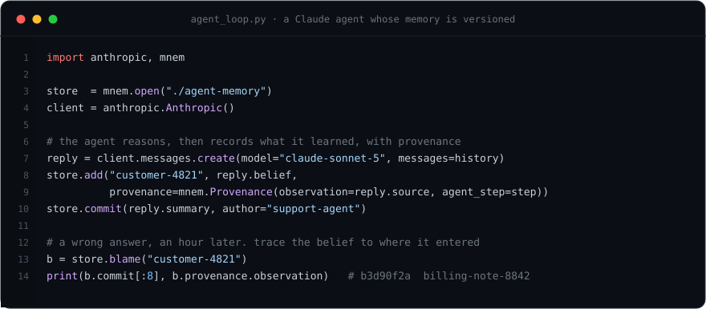

<div align="center">

# Mnemosyne

**Version control for AI agent memory.**

[](LICENSE)
&nbsp;[](https://github.com/Nabzx/mnemosyne/actions/workflows/ci.yml)
&nbsp;
&nbsp;
&nbsp;

</div>

<p align="center">
  
</p>

An AI agent builds up memory as it works: facts it learns, decisions it makes, conclusions it reaches. Frameworks store that as state the agent overwrites as it goes — so the moment it gets something wrong, the history is gone.

Mnemosyne gives agent memory what Git gives code: **commits, history, branches, merge, blame and bisect.** It is a Rust core with a `mnem` CLI and a Python SDK. Local, deterministic, no network, no model calls.

## The problem

Your agent runs for an hour, makes forty tool calls, and updates its memory the whole way. Then it gets something wrong.

You go to debug it, and all you have is the memory as it stands right now. You cannot see when a bad fact got in, what the agent knew before it went off track, or why it believes what it believes. You cannot fork the memory, try three approaches, and keep the best. And when two agents share one store, the last write wins.

Version control solved exactly this for code. Agent memory needs the same.

## Record

Every change the agent makes to its memory is a commit: an immutable, content-addressed snapshot, stamped with **where each fact came from**. `log` walks the history; `show <commit>` reconstructs the memory exactly as it stood at any point in the past.

```console
$ mnem add customer-4821 "on the Enterprise plan" --source ticket-4821
Staged customer-4821 as 9f2c1a7b4e08
$ mnem commit -m "open the case" --author support-agent
[a17e42c9] open the case

$ mnem show a17e42c9              # the memory exactly as it stood then
customer-4821  "on the Enterprise plan"
```

## Explore

`branch` forks the memory for the price of a pointer. The agent tries a hypothesis — *what if the customer downgraded?* — on its own line, and you `diff` the two. `merge` brings a branch back; where both lines changed the same fact to different things, you get a **conflict object you can inspect and resolve**, not a silent overwrite.

```console
$ mnem checkout -b what-if-downgraded
$ mnem add customer-4821 "downgraded to Pro"
$ mnem diff
~ customer-4821
  - "on the Enterprise plan"
  + "downgraded to Pro"

$ mnem merge what-if-downgraded          # back on main
Merge conflict in 1 node(s):
  customer-4821 (edit/edit)
    ours:    "on the Enterprise plan"
    theirs:  "downgraded to Pro"
```

## Explain

An hour later, a wrong answer. `bisect` binary-searches the run for the first commit where the bad belief appears. `blame` resolves any fact to the commit that set it — following it back through merges — and the provenance recorded with it. One command tells you **where the belief entered and what caused it.**

```console
$ mnem bisect --node customer-4821 --equals '"downgraded to Pro last month"'
b3d90f2a  reconcile the plan tier from billing
  customer-4821 set here, from step step-31, source billing-note-8842

$ mnem blame customer-4821
b3d90f2a  2026-02-14 09:41Z
  commit:  reconcile the plan tier from billing
  content: "downgraded to Pro last month"
  step:    step-31
  source:  billing-note-8842        ← the misread observation
```

## From your agent code

The same operations, from the Python SDK. Point it at a store, and every conclusion your Claude agent reaches becomes a commit with provenance — so a wrong answer is always traceable.

<p align="center"></p>

```python
import anthropic, mnem

store  = mnem.open("./agent-memory")
client = anthropic.Anthropic()

# the agent works a ticket; each thing it concludes is a commit, with provenance
reply = client.messages.create(model="claude-sonnet-5", messages=history)
belief, source = extract(reply)                       # your parsing
store.add("customer-4821", belief,
          provenance=mnem.Provenance(observation=source, agent_step="step-31"))
store.commit("reconcile the plan tier from billing", author="support-agent")

# an hour later, a wrong answer — trace the belief back to where it entered
b = store.blame("customer-4821")
print(b.commit[:8], "·", b.node.content, "·", b.provenance.observation)
# b3d90f2a · downgraded to Pro last month · billing-note-8842
```

## Install

```bash
# not published yet; build from source
cargo build --release -p mnem-cli      # the mnem binary -> target/release/mnem
pip install -e ".[dev]"                # the mnem python sdk
```

```python
import mnem

store = mnem.init("./agent-memory")
store.add("customer-4821", "on the Enterprise plan",
          provenance=mnem.Provenance(source="ticket-4821"))
store.commit("learn the plan tier", author="support-agent")

with store.branch("assume-downgrade"):          # try an idea, keep it or drop it
    store.add("customer-4821", "downgraded to Pro")
    store.commit("assume the downgrade", author="support-agent")

for c in store.log():
    print(c.id[:12], c.message)
```

## The GitHub for AI agents

Git made source code collaborative. GitHub made it social: pull requests, review, forks, and a registry the whole ecosystem is built on. As software becomes agents, and agents start working in teams, they need that same stack underneath them. Mnemosyne is building it, in three eras.

1. **The substrate** *(now)*. Single-agent versioned memory: commit, branch, merge, blame, bisect, time travel. Local and deterministic.
2. **The collaboration layer.** Semantic merge that reasons about contradiction, a sync protocol between stores, and a review step so one agent's memory update is checked before it lands in shared memory. Pull requests, for agent memory.
3. **The platform** *(`1.0`)*. The whole agent — its prompt, tools, memory, policy and evaluations — as one versioned, signed, forkable artefact, with a registry to publish, discover and improve them. The GitHub for AI agents.

The later two are the point. Everything today is `0.0.x` groundwork ([ADR-0010](docs/adr/0010-what-1-0-means.md)).

## How it works

- **`mnem-core` (Rust)** — the object model, the content-addressed store, the commit graph, and every deterministic operation on them. It never touches the network and never calls a model; a CI check (`cargo deny`) bans every network and TLS crate from its dependency tree.
- **`mnem` (Rust binary)** — the command line interface.
- **`mnem` (Python)** — the SDK an agent calls.
- **The store** is a `.mnem/` directory, in the spirit of `.git/`. Its format is specified in full in [`docs/format/`](docs/format) and frozen for the `0.0.x` line at `format_version` 1.

Architecture decisions and their reasoning live in [`docs/adr/`](docs/adr).

## Status

Early development, and numbered to say so: the whole current roadmap is `0.0.x` ([ADR-0010](docs/adr/0010-what-1-0-means.md)). Shipped so far:

| Tag | What landed |
| --- | --- |
| `v0.0.2` | the object store, `commit`, `add`, `log`, the Python binding |
| `v0.0.3` | `branch`, `checkout`, `diff`, time travel |
| `v0.0.4` | deterministic three-way `merge` with conflict objects |
| `v0.0.5` | `blame`, `bisect`, the provenance index |

Next: a LangGraph adapter and an MCP server. [`ROADMAP.md`](ROADMAP.md) says what lands when; [`CHANGELOG.md`](CHANGELOG.md) records what already has.

## Prior work

A wave of 2026 research points straight at this idea: Git4Data, GitOfThoughts, StateFuse, MemTX and LatticeMind. Every one is a paper or a prototype. Mnemosyne is the engineered implementation they point towards, built to be depended on.

One finding is worth stating plainly. Versioned memory does not make an agent give better answers. What it gives you is history, audit, and safe merging. That is the whole pitch, and it is enough.

## Contributing

Mnemosyne is developed by a single maintainer. Issues and feedback are welcome. The codebase is not open to external pull requests at this stage. See [`CONTRIBUTING.md`](CONTRIBUTING.md).

## Licence

Apache 2.0. See [`LICENSE`](LICENSE).
